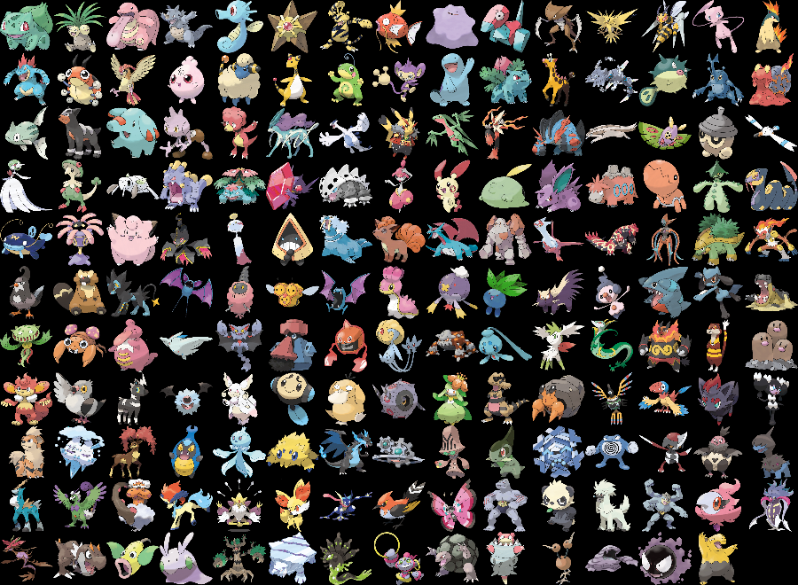
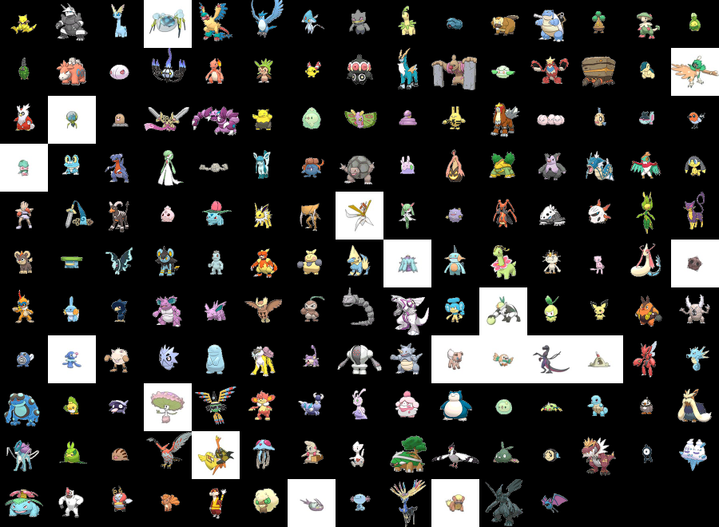

# 
POKEMON-DCGAN

* Deep Convolution GAN network to generate pokemon characters

 
#### Datasets
|Link|https://www.kaggle.com/kvpratama/pokemon-images-dataset|
|-|-|-|
|Size of each image | 256 x 256 |
||
|Sample| |

 

|Link|https://www.kaggle.com/vishalsubbiah/pokemon-images-and-types|
|-|-|-|
|Size of each image | 120 x 120 |
||
|Sample| |

* Create following folders

	* data/dcgan_color/pokemon/
	
	* data/dcgan_color/checkpoint/
	
	* data/dcgan_color/output/

* After downloading merge images of these two datasets into {data/dcgan_color/pokemon/} directory.

 
#### DCGAN Model

* Base model idea : https://github.com/eriklindernoren/Keras-GAN/blob/master/dcgan/dcgan.py

* Modified Model

	

	
	|
GENERATOR MODEL
|
	|-|
	|
<b>Input Image Size  \{128 x 128 x 3\}</b>
|
	|
<b style="background-color:white;">Dense \{units = 2 x 2 x latent_dim\}</b>
 |
	|
<b style="background-color:white;">Activation \{'relu'\}</b> 
|
	|
<b style="background-color:white;">Reshape \{target_shape=(2, 2, latent_dim)\}</b>
|
	||
	|
<b style="background-color:white;">Upsampling \{size=(2, 2)\}</b>
|
	|
<b style="background-color:white;">Conv2D \{filters=512, kernel_size=(3, 3), strides=1, padding='same'\}</b>
|
	|
<b style="background-color:white;">BatchNorm \{momentum=0.7\}</b>
|
	|
<b style="background-color:white;">Activation \{'relu'\}</b>
|
	||
	|
<b style="background-color:white;">Upsampling \{size=(2, 2)\}</b>
|
	|
<b style="background-color:white;">Conv2D \{filters=512, kernel_size=(3, 3), strides=1, padding='same'\}</b>
|
	|
<b style="background-color:white;">BatchNorm \{momentum=0.7\}</b>
|
	|
<b style="background-color:white;">Activation \{'relu'\}</b>
|
	||
	|
<b style="background-color:white;">Upsampling \{size=(2, 2)\}</b>
|
	|
<b style="background-color:white;">Conv2D \{filters=256, kernel_size=(3, 3), strides=1, padding='same'\}</b>
|
	|
<b style="background-color:white;">BatchNorm \{momentum=0.7\}</b>
|
	|
<b style="background-color:white;">Activation \{'relu'\}</b>
|
	||
	|
<b style="background-color:white;">Upsampling \{size=(2, 2)\}</b>
|
	|
<b style="background-color:white;">Conv2D \{filters=128, kernel_size=(3, 3), strides=1, padding='same'\}</b>
|
	|
<b style="background-color:white;">BatchNorm \{momentum=0.7\}</b>
|
	|
<b style="background-color:white;">Activation \{'relu'\}</b>
|
	||
	|
<b style="background-color:white;">Upsampling \{size=(2, 2)\}</b>
|
	|
<b style="background-color:white;">Conv2D \{filters=64, kernel_size=(3, 3), strides=1, padding='same'\}</b>
|
	|
<b style="background-color:white;">BatchNorm \{momentum=0.7\}</b>
|
	|
<b style="background-color:white;">Activation \{'relu'\}</b>
|
	||
	|
<b style="background-color:white;">Conv2D \{filters=64, kernel_size=(3, 3), strides=1, padding='same'\}</b>
|
	|
<b style="background-color:white;">BatchNorm \{momentum=0.7\}</b>
|
	|
<b style="background-color:white;">Activation \{'relu'\}</b>
|
	||
	|
<b style="background-color:white;">Conv2D \{filters=3, kernel_size=(3, 3), strides=1, padding='same'\}</b>
|
	|
<b style="background-color:white;">Activation \{'tanh'\}</b>
|
	
	 
	
	|
DISCRIMINATOR MODEL
|
	|-|
	|
<b>Input Image Size  \{128 x 128 x 3\}</b>
|
	||
	|
<b style="background-color:white;">Conv2D \{filters=32, kernel_size=(3, 3), strides=2, padding='same'\}</b>
|
	|
<b style="background-color:white;">Leaky Relu \{alpha=0.2\}</b>
|
	|
<b style="background-color:white;">Dropout \{rate=0.25\}</b>
|
	||
	|
<b style="background-color:white;">Conv2D \{filters=64, kernel_size=(3, 3), strides=2, padding='same'\}</b>
|
	|
<b style="background-color:white;">Zero Padding \{padding=((0, 1), (0, 1))\}</b>
|
	|
<b style="background-color:white;">BatchNorm \{momentum=0.8\}</b>
|
	|
<b style="background-color:white;">Leaky Relu \{alpha=0.2\}</b>
|
	|
<b style="background-color:white;">Dropout \{rate=0.25\}</b>
|
	||
	|
<b style="background-color:white;">Conv2D \{filters=128, kernel_size=(3, 3), strides=2, padding='same'\}</b>
|
	|
<b style="background-color:white;">BatchNorm \{momentum=0.8\}</b>
|
	|
<b style="background-color:white;">Leaky Relu \{alpha=0.1\}</b>
|
	|
<b style="background-color:white;">Dropout \{rate=0.25\}</b>

	||
	|
<b style="background-color:white;">Conv2D \{filters=128, kernel_size=(3, 3), strides=1, padding='same'\}</b>
|
	|
<b style="background-color:white;">BatchNorm \{momentum=0.8\}</b>
|
	|
<b style="background-color:white;">Leaky Relu \{alpha=0.1\}</b>
|
	|
<b style="background-color:white;">Dropout \{rate=0.25\}</b>

	||
	|
<b style="background-color:white;">Flatten</b>
|
	|
<b style="background-color:white;">Dense \{units = 1\}</b>
|
	|
<b style="background-color:white;">Activation \{'sigmoid'\}</b>
|

	

	
* Other parameters

	* Optimizer
		
		* Discriminator : Adam (learning_rate = 0.0001)
		
		* Generator : Adam (learning_rate = 0.001)
		
	* Losses
	
		* Binary Crossentropy Loss
	
	* Resize and pad images so that each image must be of size 128 x 128 x 3.

* Required Libraries

	* Tensorflow 2.0+
	
	* Opencv 3.0+
	
	* Numpy 1.18+
	
	* Matplotlib

 
#### Result

|
From The Begning Of Training
|
|-|
| |

|
In Between Training
|
|-|
| |

